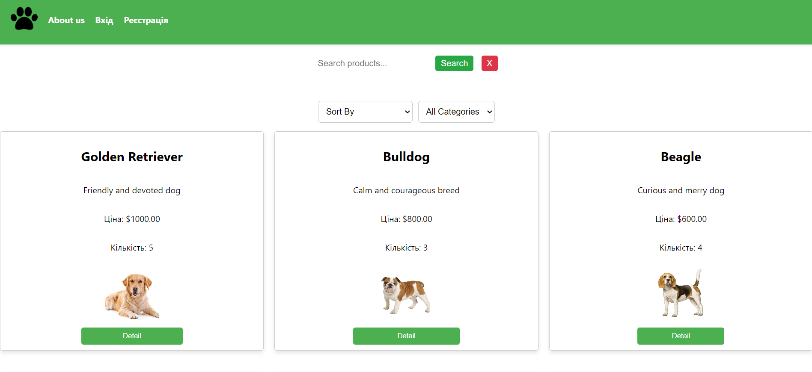

# PetShop

# Table of Contents
- [PetShop](#petshop)
- [Table of Contents](#table-of-contents)
  - [Description](#description)
  - [Usage](#usage)
  - [Installation](#installation)
    - [1. Clone the Repository](#1-clone-the-repository)
    - [2. Create virtual enviroment for python](#2-create-virtual-enviroment-for-python)
    - [3. Run backend server](#3-run-backend-server)
    - [4. Run frontend server](#4-run-frontend-server)
  - [Contributing](#contributing)
  - [License](#license)

## Description

PetShop is a full-stack web application built with ReactJS and Django, designed for browsing and purchasing animals with an intuitive interface.


## Usage

- Sign In/Sign Up: Log in to your existing account or create a new one.
- Browse Animals: Use search, sort, and filter options to find specific animals.
- Add to Cart: Add desired animals to your cart.
- View Cart: Check the contents of your cart on your profile page.
- Product Page: View information about each animal on the product page.
- Write Comment: Leave reviews or comments on the product page.
- Purchase: Complete your purchase through a streamlined checkout process.
- Log Out: Log out when you want to end your session or switch accounts.

## Installation

Follow these steps to get started

### 1. Clone the Repository
```bash
git clone https://github.com/Vasya-556/petshop.git
cd petshop
```

### 2. Create virtual enviroment for python
```bash
python -m venv env
# On Windows
env\Scripts\activate
# On macOS/Linux
source env/bin/activate
cd backend
pip install -r requirements.txt
```

### 3. Run backend server
```bash
cd backend
python manage.py migrate
python manage.py runserver
```

### 4. Run frontend server
```bash
cd frontend
npm start
```

## Contributing

Pull requests are welcome.

## License

[MIT](LICENSE)